# Enfour Memory

Local RAG for coding agents, with keyword search and semantic search in one Rust service.
Keep facts, exact evidence, and revision history across sessions.

[Connect](docs/connect.md) · [Self-host](docs/self-host.md) · [Reference](docs/reference.md) · [Measurements](docs/benchmarks.md) · [Development](docs/development.md) · [Mermaid source](docs/architecture.md)

## Architecture

<a href="assets/diagrams/rag.light.generated.svg"><picture><source media="(prefers-color-scheme: dark)" srcset="assets/diagrams/rag.dark.generated.svg"></picture></a>

## Save

<a href="assets/diagrams/write.light.generated.svg"><picture><source media="(prefers-color-scheme: dark)" srcset="assets/diagrams/write.dark.generated.svg"></picture></a>

## Recall

<a href="assets/diagrams/recall.light.generated.svg"><picture><source media="(prefers-color-scheme: dark)" srcset="assets/diagrams/recall.dark.generated.svg"></picture></a>
