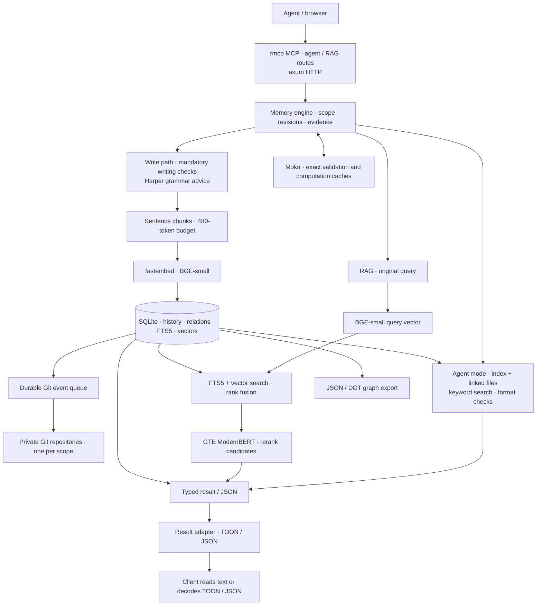
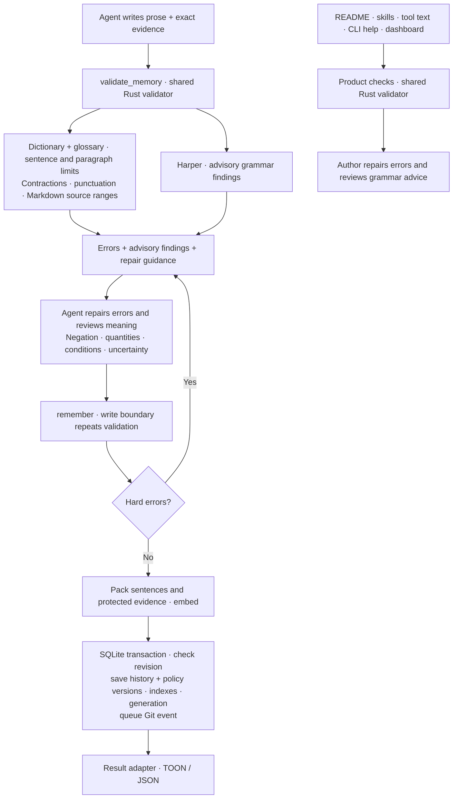

# Enfour Memory

Local memory for coding agents. One Rust service stores facts, decisions, evidence, and revision history.
Local models find and rank records. SQLite stores the text and 384-dimension vectors.

**rmcp · axum · fastembed · SQLite · Moka · TOON**

No cloud inference or telemetry. Your agent can send retrieved text to its model provider.

## Start

Use Linux x86-64, Docker Compose, Python 3.11 or newer, and about 3 GiB of RAM.
Run these commands from the repository root:

```sh
scripts/enfour cargo image
scripts/enfour cargo fetch
scripts/enfour cargo build --release --locked --offline
scripts/enfour models
scripts/enfour language --pdf /private/ASD-STE100_ISSUE9.pdf
scripts/enfour up --build
```

Get [ASD-STE100 Issue 9](https://www.asd-ste100.org/STE_downloads.html) and install Poppler before the language import.
The importer verifies the PDF hash and dictionary layout. Keep the PDF and dictionary private.
Missing or invalid language data blocks writes. Read operations stay available.

Open <http://127.0.0.1:7463>. Use the token from `state/access.token`.
The dashboard keeps this token only in memory.

```sh
scripts/enfour status
scripts/enfour logs --follow
scripts/enfour down
scripts/enfour --help
```

The operation commands use Python. The engine and MCP server use Rust.
Builds use the local Linux Docker socket, Cargo downloads, and sccache.
The existing shared compiler cache is used when available. Otherwise, builds use a local file cache.

Use `up --build` after a new release build. Use `up` to start the existing image.

## Connect

Clients use the server URL and bearer token. The default port is **TCP 7463**.
For LAN access, copy `.env.example` to `.env`. Set `ENFOUR_BIND` and add the server name to `ENFOUR_HOSTS`.
Use a trusted LAN, TLS proxy, or SSH tunnel.

For Codex on a client computer, add this section to `~/.codex/config.toml`:

```toml
[mcp_servers.enfour-memory]
url = "http://memory.example.com:7463/mcp"
http_headers = { Authorization = "Bearer YOUR_TOKEN" }
startup_timeout_sec = 30
tool_timeout_sec = 180
```

Replace the hostname and token. Keep the file private. Restart the client.
For a client on the Linux server, `scripts/enfour clients` sets up the connector with a file token.
Use `clients --help` for client selection and configuration source files.

Install the two skills on the client computer:

```sh
DISABLE_TELEMETRY=1 npx skills add http://memory.example.com:7463 --agent codex --skill enfour-recall enfour-maintain -g
```

The public `/mcp/skills` endpoint also returns installation instructions. It has no access to memory data.
Use one stable scope for each project, such as `repo:example.com/team/project`.
The skills give instructions for scope selection. One token gives access to all scopes.

## Modes

Select the MCP URL. Both modes use the same records, write checks, and result formats.

| Route | Read behavior |
| --- | --- |
| `/mcp` or `/mcp/rag` | Hybrid search with embeddings and reranking. |
| `/mcp/agent` | Read `MEMORY.md`, follow file links, and use keyword search without retrieval inference. |

Agent mode adds file reads, repository validation, export, and one-record import.
The file view follows the [Agent Memory Repo format](https://github.com/AgentMemoryRepo/agentmemoryrepo/blob/8798cb26c817d451a5ed6cba0ad8d9eca8d5ec3e/SPEC.md).
SQLite stores the source records. The service creates a private Git repository for each scope in `state/.agent-memory/`.

No project checkout or client Git setup is necessary. Each accepted change adds a SQLite queue event in the write transaction.
A background process records each event in Git. Failed Git writes retry. Current reads continue through SQLite.

`/api/status` reports `agent_git.applied_event`, `queued_event`, and `error`.

Format checks examine the entry point, entries, metadata, dates, paths, and file links.
Unknown metadata keys are accepted. Sources are optional in the format but mandatory for Enfour writes.
Scripts are data. Scheduled consolidation is not included.

```sh
scripts/enfour repo check /path/to/memory-repo
scripts/enfour repo export memory-exports/project --scope repo:example.com/team/project
scripts/enfour repo import --help
```

Exports contain current records. Imports accept one exported Enfour record and repeat the writing checks before embedding.
Git history starts when this feature is enabled. Earlier revisions stay in SQLite.

## Memory tools

| Tool | Use |
| --- | --- |
| `recall` | Find project evidence. |
| `validate_memory` | Check prose and return errors, advisory findings, and source ranges. |
| `remember` | Save a fact, preference, decision, lesson, or checkpoint. |
| `inspect` | Read a record and its revision history. |
| `forget` | Hide a record from results. Keep its history. |
| `relate` | Link current records with a typed relation and source. |
| `graph` | Export nodes, edges, revision IDs, and sources. |

Writes must have a source and the current revision. Use revision `0` for a new key.
Inspect before updates. The agent selects the information to save and reviews its meaning.

Tool results use TOON by default. Select the result text with the `minify` HTTP header:

| Value | Format |
| --- | --- |
| `toon` or missing | TOON |
| `uglify-json` | Compact JSON |
| `none` | JSON with spaces and newlines |

Only result text changes. Inputs, storage, retrieval, and reranking keep JSON or typed data.
A client can read TOON directly or decode it to JSON. The server does not accept TOON inputs.

For a frontend, use `/api/recall`, `/api/graph`, `/api/graph.dot`, and `/api/status` with bearer authentication.
The graph endpoints accept `?scope=…`. They return JSON or Graphviz DOT, independent of `minify`.

## Architecture



### Writing and grammar checks



Enfour applies a 20-word sentence limit and six-sentence paragraph limit to prose.
Preserve exact evidence in Markdown code or quotations. Add prose about the evidence and a source.
Queries, identifiers, and model prefixes keep their original form. Vectors contain numbers, not language.

Harper findings are advisory. Passed checks do not show complete STE compliance.
[Contextual review is necessary](https://www.asd-ste100.org/STEsoftware.html).
Rejected writes use no inference and change no records or indexes.
Accepted revisions record policy, validator, dictionary, and glossary versions.

<details>
<summary>Issue 9 rule coverage</summary>

| Coverage | Rules | Checks or review |
| --- | --- | --- |
| Enforced | 1.1 | Dictionary membership and software glossary. |
| Enforced | 4.1, 5.1, 6.3 | 20-word limit. Issue 9 has a 25-word limit in descriptions. |
| Enforced | 4.2, 6.6 | Unambiguous contractions and paragraph length. |
| Enforced | 8.1, 8.4–8.7 | Prose semicolons and word counting. Review ambiguous names. |
| Advisory | 1.2, 1.4, 2.1, 3.1–3.6 | Grammatical roles, forms, noun groups, and possible passive constructions. |
| Contextual review | 1.3, 1.5–1.14, 2.2, 3.7, 4.3–4.5, 5.2–5.5 | Meanings, technical names, articles, lists, and instructions. |
| Contextual review | 6.1–6.2, 6.4–6.5, 7.1–7.3, 8.2–8.3, 9.1–9.4 | Information order, related paragraphs, risk statements, punctuation, and consistent terms. |

</details>

Recall uses one database snapshot. It combines keyword and vector results, then reranks up to 64 candidates.

Caches use exact inputs and model identities. Validation also uses policy and dictionary fingerprints.
Ranking cache keys include scope, database generation, and expiry. Cache hits check expiry again.
Eviction changes speed, not results. Changed text receives new embeddings.

## Operations

Keep `state/`, `models/`, and `language-private/` external to the public code repository. Language data mounts read-only.
Create a consistent backup with:

```sh
scripts/enfour cli --lexical-only backup /data/backup.sqlite
```

The destination must not exist. Save the private Git directory, access token, models, dictionary, and runtime image with the database backup.
Stop the service before you restore data. Keep the previous state, including WAL and SHM files, until verification is complete.
Rebuild indexes after changes to the embedding model or chunk format.

For NixOS, import [nixos/module.nix](nixos/module.nix). It creates the boot service `enfour-memory.service`.
Set `services.enfour-memory.enable = true` and `imageFile` to a pinned Docker image archive in the Nix store.
Before activation, stop Compose and copy state, models, and language data into the configured `dataDir`.
Use `state/`, `models/`, and `language/` there. Set ownership to the module's `uid` and `gid`.

Use systemd for this service. The Python commands control the checkout's Compose service.

Existing memories must have reviewed revisions before policy migration. The native CLI includes `audit-language` and `migrate-language`.
Review facts, exact evidence, and relations. Stop the service before migration. Keep its backup until verification is complete.

## Measurements

Reference host: **ThinkPad T480s · i7-8650U · 16 GiB RAM**. Service limit: two CPUs and 3 GiB.
Models: quantized BGE-small-en-v1.5 and GTE ModernBERT, about 211 MiB of files.

The selected profile measured **74.63% Recall@5** and **0.6779 nDCG@10** on 340 LoCoMo development queries.
These queries selected the profile. This is not an independent test result or leaderboard claim.

TOON measurements use v0.4 fixtures without validation metadata. Each case has 20 warmups and 2,000 measured runs.
Times include result allocation. They do not include inference, transport, or MCP envelopes. Bytes are not tokens.

| Payload | TOON bytes / µs | Compact JSON bytes / µs | Pretty JSON bytes / µs |
| --- | ---: | ---: | ---: |
| 5 recall hits | 2,127 / 15.519 | 2,936 / 3.304 | 3,652 / 4.042 |
| 16 recall hits | 6,485 / 37.037 | 9,405 / 9.708 | 11,694 / 12.978 |
| Graph | 1,554 / 5.878 | 1,737 / 1.700 | 2,079 / 2.407 |

Writing checks measured 1.626 ms at p50 without cache and 6.165 µs for exact cache hits.
This short-memory sample used 50 runs for each case. The first grammar report used 990 ms.

## Development

Use `scripts/enfour --help` for commands and each command's `--help` for arguments.
Existing `cargo-local` and `benchmark-local` commands are also available.

```sh
scripts/enfour check helpers
scripts/enfour check dashboard
scripts/enfour cargo test --locked --offline --features test-support
scripts/enfour cargo build --locked --offline --features product-check
scripts/enfour check product --language language-private/dictionary.json
scripts/enfour bench --help
```

The dashboard check uses Chromium and local fixtures. A running memory service is not necessary.
Use targeted checks for regular changes. Run retrieval evaluations at evaluation milestones.
Public tests use a synthetic dictionary with `test-support`. Release builds must remove that feature.

MIT. See [LICENSE](LICENSE). TOON test fixtures keep their license and provenance.
