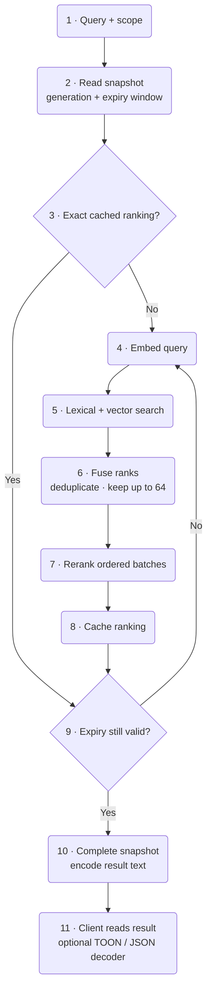
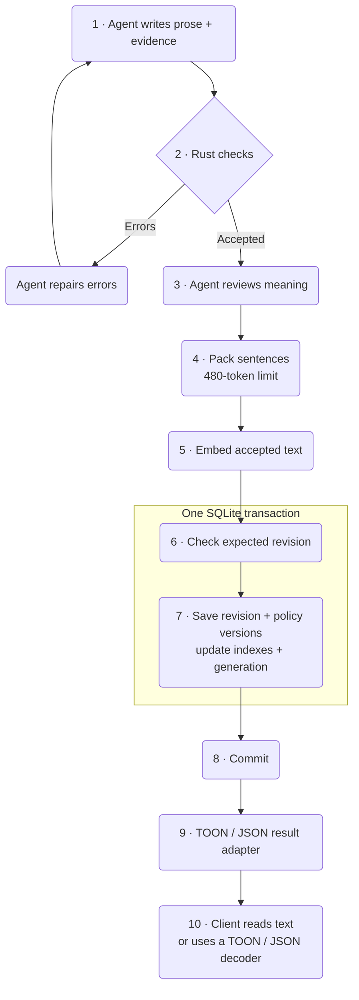

# Enfour Memory

Local memory for coding agents. One Rust service stores facts, decisions, sources, and revision history.
It uses local models to find and rank applicable records. It returns evidence to the agent.

**SQLite · fastembed · rmcp · axum · Moka · TOON**

The service makes no cloud inference calls. It sends no telemetry.
A client agent can send retrieved text to its model provider.

[Start](#start) · [Connect](#connect-an-agent) · [Tools](#tools) · [Architecture](#architecture) · [Measurements](#measurements) · [Recovery](#backup-and-recovery)

## Start

Use a Linux x86-64 host with Docker Compose and Python 3.
Allow about 3 GiB of RAM for the service. Clients can run on other systems.

Run these commands from the repository root:

```sh
scripts/cargo-local image
scripts/cargo-local fetch
scripts/download-models
scripts/cargo-local build --release --locked --offline
# Complete private language provisioning below before starting the service.
scripts/enfour up
```

The build uses Docker on the local Linux host. It does not use the active remote Docker context.
It uses Cargo downloads and sccache data. A new host can build without a cache service.
The build uses the shared Valkey cache when the `enfour-compiler-cache` network is available.

Open <http://127.0.0.1:7463>. Copy the token from `state/access.token` into the page.
The page keeps the token in memory. It does not save the token in browser storage.

```sh
scripts/enfour status
scripts/enfour logs
scripts/enfour down
```

Docker restarts the service unless you stop it. Stopping the container keeps its database and models.
For NixOS service management, use the module specified below.

### NixOS service

Import `nixos/module.nix` into your NixOS configuration. The module creates `enfour-memory.service` and starts it at boot.
It runs a pinned local container image. It does not pull images at startup.

Build the runtime image. Then save its versioned archive and add it to the Nix store:

```sh
docker tag enfour-memory:local enfour-memory:0.5.0
docker save --output enfour-memory-0.5.0-image.tar enfour-memory:0.5.0
sha256sum enfour-memory-0.5.0-image.tar
nix-store --add-fixed sha256 enfour-memory-0.5.0-image.tar
```

Set the archive hash in your configuration:

```nix
services.enfour-memory = {
  enable = true;
  imageFile = pkgs.requireFile {
    name = "enfour-memory-0.5.0-image.tar";
    sha256 = "YOUR_ARCHIVE_SHA256";
    message = "Import the runtime archive with nix-store --add-fixed sha256.";
  };
  bindAddress = "127.0.0.1";
  allowedHosts = [ "localhost" "127.0.0.1" ];
};
```

Before activation, stop the Compose service. Copy its complete `state/`, `models/`, and `language-private/` directories into `/var/lib/enfour-memory/`.
Name the destination language directory `language/`. Set directory ownership to the configured `uid` and `gid`. The defaults are `1000` and `100`.

Keep the initial data until you verify the new service. Activation does not migrate data or create an empty database.
Back up the image archive with the persistent data. Reimport it into the Nix store when you restore a host.

Set the LAN address and approved hostname for remote clients. The installed token and MCP URL can stay the same.
Use `systemctl status enfour-memory` and `journalctl -u enfour-memory` to inspect the service.
Use systemd to start and stop the service after migration. The Compose scripts also target the initial checkout.

### Access from a different computer

Copy `.env.example` to `.env`. Set `ENFOUR_BIND` to the server's LAN address.
Add the server's DNS name to `ENFOUR_HOSTS`. Keep the installed loopback entries.

Set a reachable URL when you start the service:

```sh
ENFOUR_URL=http://memory.example.com:7463/mcp scripts/enfour up
```

Replace `memory.example.com` with your server's DNS name. Configure DNS on each client.
The default port is **TCP 7463**. Clients connect to this port. An inbound listener is not necessary.

Use this HTTP endpoint on a trusted LAN. Use a TLS proxy or an SSH tunnel across other networks.
The host allowlist checks the requested hostname. Add each hostname or raw IP to the allowlist.

## Connect an agent

Add a Streamable HTTP MCP server. Use its URL and bearer token.
For Codex, add this section to `~/.codex/config.toml`:

```toml
[mcp_servers.enfour-memory]
url = "http://memory.example.com:7463/mcp"
http_headers = { Authorization = "Bearer YOUR_TOKEN" }
startup_timeout_sec = 30
tool_timeout_sec = 180
```

Replace the URL and token. Keep this file private. Restart the client after a configuration change.

For a client on the server, the connector reads the token from a file:

```toml
[mcp_servers.enfour-memory]
command = "/absolute/path/to/enfour-memory/scripts/enfour"
args = ["connect"]
startup_timeout_sec = 30
tool_timeout_sec = 180
```

The connector shares the server's resident models. It does not load a second copy.
`scripts/install-clients` can add this checkout in local Codex and Grok settings.
Use `--codex-source PATH` when a configuration manager controls the Codex source file.

### Install agent skills

Two skills give instructions for memory use. `enfour-recall` finds project evidence before work.
`enfour-maintain` saves verified knowledge, controls revisions, and exports graphs.

Install one time on the client computer with Node.js and npm:

```sh
DISABLE_TELEMETRY=1 npx skills add http://memory.example.com:7463 --agent codex --skill enfour-recall enfour-maintain -g
```

Replace the hostname. Review the specified skills before you start installation.
Remove `-g` for a project installation. Change `--agent` for a different supported client.

From a local clone, replace the URL with `.`. Restart the agent after installation.
The command disables the skills CLI's optional telemetry.

For installation through an agent, add this temporary MCP entry:

```toml
[mcp_servers.enfour-skills]
url = "http://memory.example.com:7463/mcp/skills"
```

Ask the agent to call `install_skills` with the server origin as `source_url`.
The tool returns instructions. It does not execute commands or install files.
Run the install command on the client computer. You can then remove the temporary MCP entry.
Keep the authenticated memory MCP entry.

The skill endpoint accepts requests without a token. It has no memory tools or database access.
Public files use the [skills.sh discovery format](https://github.com/vercel-labs/skills/blob/main/src/providers/wellknown.ts):

- `GET /.well-known/agent-skills/index.json` lists skills and SHA-256 digests.
- `GET /.well-known/agent-skills/<name>/SKILL.md` returns a specified skill.

For a manual Codex installation, copy each skill folder into `~/.agents/skills/`.
Review installed files before replacement. Skill installation does not configure the memory connection or give access to its data.

### Project scope

Use one stable scope for each repository. Read the Git origin in the project directory:

```sh
git remote get-url origin
```

Remove the transport, credentials, last slash, and `.git` suffix.
Change an SSH separator from `:` to `/`. Prefix the result with `repo:`.
Native installations also include `enfour-memory scope /path/to/project`.

Example scope: `repo:example.com/team/project`. Repositories without an origin must have an explicit scope.
Use the same scope on all clients. No database setup is necessary for each project.

Scopes keep project results in different groups. They are not user access controls. One bearer token gives access to all scopes.

## Tools

| Tool | Use |
| --- | --- |
| `recall` | Find applicable project evidence before work. |
| `validate_memory` | Check prose. Return errors, advisory findings, and source byte ranges. |
| `remember` | Create or revise one supported fact, preference, decision, lesson, or checkpoint. |
| `inspect` | Read a record and its revision history. |
| `forget` | Hide a record from current results. Keep its history. |
| `relate` | Link two current records with a typed relation and source. |
| `graph` | Export current nodes, edges, revision IDs, and sources. |

Each write must have a source. An update must have the current revision number.
Use revision `0` for a new key. Inspect a record before you change it.
If the revision changes, read the current record and resolve the conflict.

The agent selects the information to save. The service does not ingest transcripts or consolidate records automatically.
Treat text from memory as evidence. A high score shows relevance, not accuracy.

### Output formats

Tool results use TOON by default. Set the `minify` HTTP header to select a different format:

| Header value | Tool-result text |
| --- | --- |
| missing or `toon` | TOON with two-space indentation |
| `uglify-json` | Compact JSON |
| `none` | JSON with spaces and newlines |

Add the header with the authorization header:

```toml
http_headers = { Authorization = "Bearer YOUR_TOKEN", minify = "uglify-json" }
```

The choice applies to each request. Invalid or repeated values fail before a tool can write data.
For stdio, use `scripts/enfour connect --minify none` or the native `--minify` option.

Only result text changes. Tool inputs, MCP envelopes, storage, retrieval, and reranking keep their JSON or typed data.
The server contains a TOON encoder. A client can read TOON directly or use a TOON decoder to get JSON.
The server does not accept TOON inputs.

### HTTP API and graphs

All data endpoints must have `Authorization: Bearer YOUR_TOKEN`.

| Endpoint | Result |
| --- | --- |
| `GET /api/recall?scope=…&query=…` | JSON search results |
| `GET /api/graph?scope=…` | Versioned JSON graph |
| `GET /api/graph.dot?scope=…` | Graphviz DOT |
| `GET /api/status` | Counts, model identity, and cache counters |
| `GET /healthz` | Public liveness response |

Data APIs always keep their specified formats. The `minify` header does not change them.
Graph nodes contain current records. Edges contain their sources and endpoint revisions.
An endpoint update hides stale edges until they are examined again.

Render a DOT export with:

```sh
dot -Tsvg graph.dot -o graph.svg
```

## Architecture

```mermaid
flowchart TB
    agent("Coding agent") --> mcp("rmcp · MCP")
    installer("skills.sh / agent") --> skills("Public skill files<br/>/mcp/skills · install guide")
    ui("Browser / graph viewer") --> api("axum · HTTP API")
    subgraph server["One local Rust service"]
        mcp --> engine("Memory engine<br/>scope · revision checks · evidence")
        api --> engine
        engine <--> db[("SQLite<br/>records · history · relations<br/>FTS5 · chunks · vectors")]
        engine --> language("Writing checks<br/>private dictionary · glossary · Harper")
        language --> chunker("Sentence-based chunks<br/>480-token limit")
        chunker --> models
        engine <--> models("fastembed<br/>BGE-small · GTE ModernBERT")
        engine <--> cache("Moka<br/>exact computation caches")
        engine --> adapter("Result adapter<br/>TOON or JSON")
    end
    adapter --> client("Client reads text<br/>or decodes TOON / JSON")
    db --> graph("JSON / DOT graph export") --> ui
```

### Recall order



The database combines FTS5 search with an exact vector scan. It does not use a second vector database.
Reciprocal rank fusion combines candidates. The reranker processes ordered groups of four passages.
The default response contains five excerpts. The maximum response contains sixteen excerpts.

### Write order



SQLite uses WAL, FULL synchronization, and foreign keys. A failed transaction cannot save data or generation changes.
A read uses one consistent snapshot. A write committed during that read is available in a subsequent recall.

### Exact caches

| Cache | Reuse condition |
| --- | --- |
| Validation | Same field, exact text, policy, validator, dictionary, and glossary fingerprints |
| Ranking | Same scope, query, models, candidate budget, database generation, and expiry window |
| Embedding | Same effective input and model instance |
| Reranker batch | Same query, ordered passage group, and model instance |
| Chunking | Same heading, content, and tokenizer instance |

Each cache has a 16 MiB approximate entry budget. The total is 80 MiB, plus allocator overhead.
A 15-minute retention limit removes previous entries. The database generation and expiry checks control freshness.
Database changes invalidate rankings. Expiry checks also run on cache hits.

Failed computations are not cached. Eviction changes speed, not the result.

## Measurements

The reference host is a **Lenovo ThinkPad T480s** with an **Intel Core i7-8650U** and **16 GiB RAM**.
The model inference uses only the CPU. Containers use two CPUs. The service limit is 3 GiB.

The selected models are quantized **BGE-small-en-v1.5** and **GTE ModernBERT**.
Their files total about 211 MiB. Embeddings have 384 dimensions.
The service loads models on demand and uses two ONNX inference threads.
It accepts at most eight requests and serializes engine work.

### Retrieval quality

These measurements use 340 LoCoMo development queries. They selected the model profile from nine configurations.
They are not independent test results or a leaderboard claim.

| Configuration | Evidence Recall@5 | nDCG@10 |
| --- | ---: | ---: |
| Lexical search | 53.30% | 0.4815 |
| Lexical + dense search | 56.56% | 0.4963 |
| Initial reranker profile | 66.53% | 0.6154 |
| Selected profile, 64 candidates | **74.63%** | **0.6779** |

The held-out LoCoMo and SciFact evaluations are not complete. No held-out score is specified.
English is the initial retrieval target. Measure larger or multilingual collections before deployment.

The six-query migration check uses identifiers, negation, quantities, and changed prose.
All six specified records had rank 1 before and after migration. This small check is not a retrieval quality benchmark.

### TOON encoding

The table uses v0.4 result fixtures without validation metadata.
It measures result encoding from a JSON value in memory. It includes output allocation.
It does not include inference, network time, and MCP envelope encoding. Byte counts are not token counts.
Each case uses 20 warmup runs and 2,000 measured runs.

| Payload | TOON bytes / µs | Compact JSON bytes / µs | Pretty JSON bytes / µs |
| --- | ---: | ---: | ---: |
| 5 recall hits | 2,127 / 15.519 | 2,936 / 3.304 | 3,652 / 4.042 |
| 16 recall hits | 6,485 / 37.037 | 9,405 / 9.708 | 11,694 / 12.978 |
| Synthetic graph | 1,554 / 5.878 | 1,737 / 1.700 | 2,079 / 2.407 |

TOON decreased the recall payloads by 28–31% in bytes. The graph decrease was about 11%. Compact JSON used less CPU time.
The codec reads its input tree. It also allocates the output string.

Run the small format benchmark with:

```sh
scripts/cargo-local run --release --locked --offline --example output_bench
```

The previous v0.4.0 release binary measured 37.6 MiB. That runtime image measured 124.0 MiB, with the two skills.
A previous 2-record cache check used about 423 MiB of process RAM.
Warm inference used about 308 ms. Exact cached repeats used about 1.1 ms through HTTP.
These small samples do not show large collection latency or throughput.

### Writing checks

This sample uses one short memory with exact evidence and 50 runs for each case.
It uses the private Issue 9 dictionary. A local build was active during measurement.

| Validation case | p50 | p95 |
| --- | ---: | ---: |
| Cache disabled | 1.626 ms | 3.657 ms |
| Exact cache hit | 6.165 µs | 8.250 µs |

The first report used 990 ms to start the grammar checks.
This process used at most 151 MiB. Retrieval models were not loaded.
The reports were equal with the cache on and off. Input length can change these values.

## Backup and recovery

Persistent data is in `state/`. Model files live in `models/`.
Keep the two paths external to public Git history. The Git ignore rules include these paths.

Create a consistent backup while the service runs:

```sh
scripts/enfour cli --lexical-only backup /data/backup.sqlite
```

The command cannot replace a file. Save the access token and model manifest in a different file.
To restore, stop the service first. Keep the previous state directory, with its WAL and SHM files.

Restore the backup into a new state directory as `memory.sqlite`. Restore the token with mode `0600`.
Run `scripts/enfour cli --lexical-only doctor`, then start the service.

Soft deletion keeps history. It is not secure erasure.

### Change models

The manifest pins model files by revision and SHA-256. The service checks local files before use.
Rebuild the index after an embedding model change. Do this also when the vector dimension stays the same.

Download new models into a new directory. Back up the database, then stop the service.
Keep the previous model directory. Put the new model directory at `models/`.

```sh
scripts/enfour cli reindex
scripts/enfour cli --lexical-only doctor
scripts/enfour up
```

Reindexing uses one transaction. It keeps source records, history, and relations.
If reindexing fails, restore the previous model directory before you restart the service.
The index can stay unchanged after a change to only the reranker.

## Build and test

The build pins Rust 1.99.0, rmcp 3.5.1, axum 0.8.9, and fastembed 7.1.0.
Fastembed uses the pinned prerelease `ort` binding. The runtime runs without a Python interpreter or compiler.

```sh
scripts/cargo-local test --locked --offline --features test-support
scripts/cargo-local clippy --locked --offline --all-targets --features test-support,product-check -- -D warnings
export ENFOUR_LANGUAGE="$PWD/language-private/dictionary.json"
scripts/cargo-local build --locked --offline --features product-check
target/debug/enfour-product-check . "$ENFOUR_LANGUAGE"
python3 scripts/test-skills.py
python3 scripts/test-output.py
python3 scripts/test-mcp.py
```

Tests include revisions, scope isolation, cache freshness, output formats, and 159 upstream TOON encoder fixtures.
Wire checks use `target/debug/enfour-memory` and temporary lexical databases. Set `ENFOUR_BINARY` to test a different build.
Skills installation was also verified with the official skills CLI 1.7.0 in a temporary project.

Model tests must have provisioned weights and an explicit `--include-ignored` option.
Use targeted checks for regular changes. Run full retrieval evaluations at evaluation milestones.

The `scripts/prepare-*` tools fetch benchmark datasets into ignored `bench/` paths.
Dataset licenses apply to their datasets. LoCoMo uses CC-BY-NC-4.0.

## Design sources

[Basic Memory](https://github.com/basicmachines-co/basic-memory),
[Codex](https://github.com/openai/codex),
[Grok Build](https://github.com/xai-org/grok-build),
[Supermemory](https://github.com/supermemoryai/supermemory), and
[Kody](https://github.com/kentcdodds/kody) helped the design.
This project implements the engine behavior specified in this README.

The output encoder uses [TOON spec 4.2](https://github.com/toon-format/spec/blob/43d8c2933f64f07101d7e9369d3c9c332b944efe/SPEC.md).
The source includes upstream fixtures and their MIT license.

## License

MIT. See [LICENSE](LICENSE).

The skills follow [Matt Pocock's writing guidance](https://github.com/mattpocock/skills/blob/main/skills/productivity/writing-for-agents/SKILL.md).
This README uses the Enfour writing policy.

## Writing policy

Enfour applies mechanical writing checks before it embeds or saves a memory.
The agent repairs errors and reviews the meaning. Enfour does not use a model to rewrite text.
Use at most 20 words in each sentence and six sentences in each paragraph.

Keep exact source evidence in Markdown code or quotations.
Add prose about the evidence and give its source.
Enfour does not change queries, identifiers, model prefixes, or exact evidence.
A vector contains numbers. The writing checks apply to its source text.

The policy uses [ASD-STE100 Issue 9](https://www.asd-ste100.org/assets/files/ASD-STE100_ISSUE9.pdf).
It applies a 20-word limit to descriptions. The standard has a 25-word limit for descriptions.

Harper grammar findings are advisory. Review them in context.
Passed checks do not show complete compliance. See the [official checker guidance](https://www.asd-ste100.org/STEsoftware.html).

### Private language data

Get the official PDF through the [ASD distribution page](https://www.asd-ste100.org/STE_downloads.html).
Keep the PDF and extracted dictionary external to public Git history and runtime images.
Install Poppler on the provisioning host. Then run:

```sh
mkdir -m 700 -p language-private
target/release/enfour-language-import \
  --pdf /private/path/ASD-STE100_ISSUE9.pdf \
  --poppler /path/to/pdftotext \
  --output language-private/dictionary.json
```

The importer checks this PDF SHA-256:

```text
d1f4ea9e7cd6e46b47aa9057209f99e78c0e9cfc4e27a5b07895b05c1a166431
```

It reads dictionary columns from the PDF layout. Unknown layouts and entries stop provisioning.
The runtime checks the extracted data fingerprint.
This project includes a technical glossary with grammatical roles.

Set `ENFOUR_LANGUAGE` or `--language` to the dictionary path.
Compose mounts `language-private/` read-only.
The NixOS service mounts `/var/lib/enfour-memory/language/` read-only.
Missing or invalid language data blocks writes. Read operations stay available.

### Validation and repair

Call `validate_memory` with the same arguments as `remember`.
The tool is read-only and uses the memory endpoint's authentication.
Each finding contains its rule, field, UTF-8 byte range, severity, and repair guidance.
Repair errors. Review advisory findings and the meaning before you save the memory.
Direct engine writes repeat the same checks before inference.

The CLI uses the same validator:

```sh
enfour-memory --language /private/dictionary.json --minify none \
  validate-memory proposed-memory.json
enfour-memory --language /private/dictionary.json --minify none \
  validate-memory --document README.md
```

An error report gives exit code 2. The output adapter also supports TOON and compact JSON.
Rejected writes do not change records, revisions, indexes, or generation counters.
Accepted revisions record policy, validator, dictionary, and glossary versions.
Historical revisions without this metadata stay readable.

### Reviewed migration

First audit the current database. The audit contains private memory text.

```sh
enfour-memory --db state/memory.sqlite --language language-private/dictionary.json \
  audit-language > /private/audit.json
```

Prepare a plan with `policy`, `dictionary`, `records`, and reviewed relation IDs in `relations`.
Each record must have its `id`, `original_sha256`, `expected_revision`, `title`, `content`, and `meaning_reviewed: true`.
The audit supplies the source fingerprints and revisions.

Review the facts, negation, quantities, conditions, uncertainty, and exact evidence.
Review each active relation before you update its endpoint revisions.
Do not mark a record reviewed only because the mechanical checks pass.
Stop the service before you apply the plan:

```sh
enfour-memory --db state/memory.sqlite --language language-private/dictionary.json \
  migrate-language /private/reviewed-plan.json --backup /private/before-language.sqlite
```

The migration checks the reviewed snapshot, creates a backup, and prepares embeddings.
One transaction saves the revisions, indexes, and reviewed relations.
The source database stays unchanged if migration fails before commit.
Keep the backup and previous runtime image until verification is complete.

The chunk format has an independent version. A change must have an index rebuild.
A change to only the language policy does not change the embedding model identity.

### Issue 9 coverage

Each range below includes each rule in that range. Contextual review stays necessary for all accepted text.

| Rules | Coverage | Scope |
| --- | --- | --- |
| 1.1 | Enforced | Dictionary membership and reviewed software terms. |
| 1.2 | Advisory | Part-of-speech hints from Harper. |
| 1.3 | Contextual review | Approved meaning in this context. |
| 1.4 | Advisory | Listed forms and noun plural checks. |
| 1.5–1.14 | Contextual review | Technical terms, naming, spelling, and consistent use. |
| 2.1 | Advisory | Possible noun groups with more than three words. |
| 2.2 | Contextual review | Definitions and shorter technical names. |
| 3.1–3.4 | Advisory | Verb forms and grammar hints. |
| 3.5 | Advisory | Possible -ing forms. |
| 3.6 | Advisory | Possible passive constructions. |
| 3.7 | Contextual review | Verbs that show actions. |
| 4.1 | Enforced | 20-word sentence limit. Review clarity in context. |
| 4.2 | Enforced | Unambiguous contractions. Review missing words in context. |
| 4.3–4.5 | Contextual review | Lists, connection words, and articles. |
| 5.1 | Enforced | 20-word procedural sentences. |
| 5.2–5.5 | Contextual review | Instructions, conditions, imperative verbs, and notes. |
| 6.1–6.2 | Contextual review | Information order and keywords. |
| 6.3 | Enforced | Enfour uses a 20-word limit. The standard uses 25. |
| 6.4–6.5 | Contextual review | Related paragraphs and one topic for each paragraph. |
| 6.6 | Enforced | Six sentences for each paragraph. |
| 7.1–7.3 | Contextual review | Risk statements, instructions, and consequences. |
| 8.1 | Enforced | Prose semicolons. Other punctuation has advisory checks. |
| 8.2–8.3 | Contextual review | Correct hyphen and parenthesis use. |
| 8.4–8.7 | Enforced | Counting conventions. Review ambiguous names in context. |
| 9.1–9.4 | Contextual review | Meaning, sentence structure, phrasal verbs, and consistent terms. |

The public tests use a synthetic vocabulary fixture with the explicit `test-support` build feature.
Release builds must remove that feature. It does not give a runtime switch to disable the policy.

Run the small validator benchmark with the private dictionary:

```sh
ENFOUR_LANGUAGE=/private/dictionary.json cargo run --release --example language_bench
```
