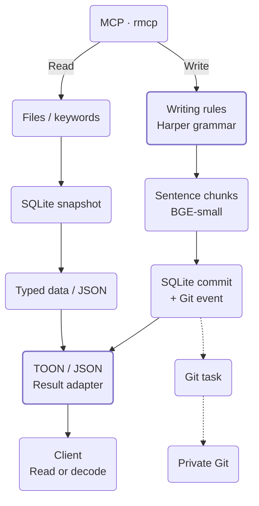
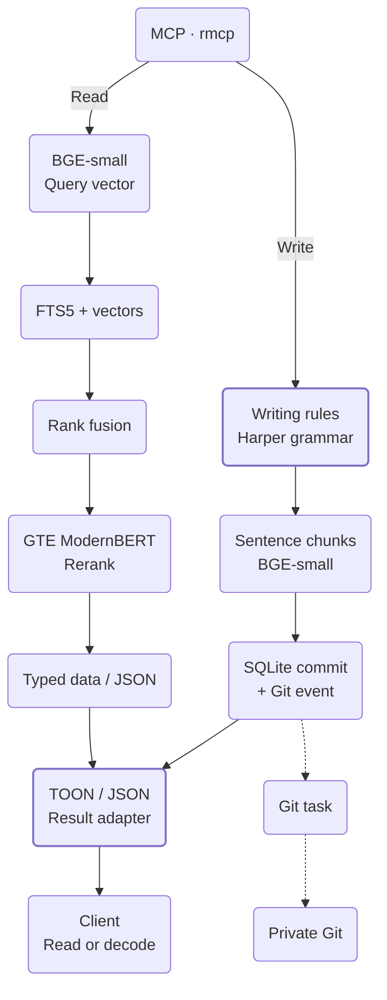

# Enfour Memory

Local memory for coding agents, with notes and file links and semantic search in one Rust service.
Keep facts, exact evidence, and revision history across sessions.

[Connect](#connect) · [Two modes](#two-modes) · [Self-host](#self-host) · [Measurements](#measurements) · [Reference](#reference)

## Connect

Use an existing server's URL and bearer token. Add this to `~/.codex/config.toml` on the agent's computer:

```toml
[mcp_servers.enfour-memory]
url = "http://memory.example.com:7463/mcp/agent"
http_headers = { Authorization = "Bearer YOUR_TOKEN" }
startup_timeout_sec = 30
tool_timeout_sec = 180
```

Replace the hostname and token. Keep the configuration private, then restart the client.
Use `/mcp/rag` for hybrid search. The existing `/mcp` endpoint also uses RAG.
One token gives access to all scopes. Use a trusted LAN, TLS proxy, or SSH tunnel.

Install the skills on the agent's computer with Node.js and `npx`:

```sh
DISABLE_TELEMETRY=1 npx skills add http://memory.example.com:7463 --agent codex --skill enfour-recall enfour-maintain -g
```

The skills select a stable project scope, check saved claims, and help with memory writes. Try:

> Save this project decision: use SQLite for local storage. Use this session as the source.

In a new session:

> Recall the storage decision for this project and show its source.

The server runs the local models. No model files or memory checkout are necessary on clients.
Enfour uses no cloud inference or telemetry. Your agent can send retrieved text to its model provider.

## Two modes

Change the endpoint to select how the agent reads. Both modes share records, writing checks, and revision history.

<table>
<thead><tr><th>Agent memory</th><th>RAG</th></tr></thead>
<tbody>
<tr><td nowrap><code>/mcp/agent</code><br/>Read project notes, follow file links, or search exact terms.</td><td nowrap><code>/mcp/rag</code> · <code>/mcp</code><br/>Search keywords and vectors, then rerank related passages.</td></tr>
<tr>
<td valign="top" nowrap><a href="assets/diagrams/agent.light.generated.svg"><picture><source media="(prefers-color-scheme: dark)" srcset="assets/diagrams/agent.dark.generated.svg"></picture></a></td>
<td valign="top" nowrap><a href="assets/diagrams/rag.light.generated.svg"><picture><source media="(prefers-color-scheme: dark)" srcset="assets/diagrams/rag.dark.generated.svg"></picture></a></td>
</tr>
</tbody>
</table>

Open each graph for a larger view. The two columns show the same SQLite store.
Writing rules must pass before inference. Harper grammar findings are advisory.

Agent reads use no retrieval inference. Accepted writes update embeddings in each mode.
Moka caches exact computation. Cache inputs and versions must be the same. Graph endpoints export JSON or DOT for a frontend.

<details>
<summary>Native Mermaid diagrams</summary>

### Agent memory

<!-- diagram: agent -->


### RAG

<!-- diagram: rag -->


</details>

SQLite stores the source records. Each scope has a private Git repository that the service controls.

Accepted changes queue Git events in the same database transaction. Failed Git updates retry. Current reads use SQLite.

No client Git setup is necessary. Git history starts when this feature is enabled. Previous revisions stay in SQLite.

The file view follows the [Agent Memory Repo format](https://github.com/AgentMemoryRepo/agentmemoryrepo/blob/8798cb26c817d451a5ed6cba0ad8d9eca8d5ec3e/SPEC.md).
[Cognition's article](https://cognition.com/agent-memory-repo) shows how agents use memory files.

## Self-host

Use a Linux x86-64 server with Docker Compose, Python 3.11 or newer, and about 3 GiB of RAM.
Get [ASD-STE100 Issue 9](https://www.asd-ste100.org/STE_downloads.html) and install Poppler.
The private dictionary is mandatory for writes. Keep the PDF and extracted dictionary out of Git.

Run these commands from the repository root:

```sh
scripts/enfour cargo image
scripts/enfour cargo fetch
scripts/enfour cargo build --release --locked --offline
scripts/enfour models
scripts/enfour language --pdf /private/ASD-STE100_ISSUE9.pdf
scripts/enfour up --build
```

Open <http://127.0.0.1:7463>. The token is in `state/access.token`.
For LAN access, copy `.env.example` to `.env`, set `ENFOUR_BIND`, and add the hostname to `ENFOUR_HOSTS`.
The default port is TCP 7463. The dashboard keeps its token only in memory.

Builds use the local Linux Docker socket, Cargo downloads, and sccache.
Use `scripts/enfour --help` for commands. Use `up --build` after a new release build.

<details>
<summary>NixOS and recovery</summary>

Import [nixos/module.nix](nixos/module.nix). Set `services.enfour-memory.enable = true` and `imageFile` to a pinned image archive.
Before activation, stop Compose. Copy state, models, and language data into the module's `dataDir`.
Use `state/`, `models/`, and `language/` there, with the configured `uid` and `gid`.
The boot service is `enfour-memory.service`.

Use systemd to control it. The Python commands control the checkout's Compose service.

Create a consistent database backup:

```sh
scripts/enfour cli --lexical-only backup /data/backup.sqlite
```

The destination must not exist. Also save private Git history, the token, models, dictionary, and runtime image.

Stop writers before a database and Git backup. Stop the service before restore or migration.
Keep the previous state, including WAL and SHM files, until verification is complete.

Rebuild indexes after model or chunk-format changes. Review existing memories before `migrate-language`. Keep the original revisions and migration backup.

</details>

## Measurements

Reference host: **ThinkPad T480s · i7-8650U · 16 GiB RAM**. Service limit: two CPUs and 3 GiB.
Quantized BGE-small-en-v1.5 and GTE ModernBERT use about 211 MiB of model files.

The selected profile measured **74.63% Recall@5** and **0.6779 nDCG@10** on 340 LoCoMo development queries.
These queries selected the profile. This is not an independent test result or leaderboard claim.

TOON measurements use v0.4 fixtures without validation metadata: 20 warmups and 2,000 measured runs for each case.
Times include result allocation, without inference, transport, or MCP envelopes. Bytes are not tokens.

| Payload | TOON bytes / µs | Compact JSON bytes / µs | Pretty JSON bytes / µs |
| --- | ---: | ---: | ---: |
| 5 recall hits | 2,127 / 15.519 | 2,936 / 3.304 | 3,652 / 4.042 |
| 16 recall hits | 6,485 / 37.037 | 9,405 / 9.708 | 11,694 / 12.978 |
| Graph | 1,554 / 5.878 | 1,737 / 1.700 | 2,079 / 2.407 |

Writing checks measured 1.626 ms at p50 without cache and 6.165 µs for exact cache hits.
This short-memory sample used 50 runs for each case. The first grammar report used 990 ms.

## Reference

<details>
<summary>Tools, formats, and frontend APIs</summary>

| Tools | Purpose |
| --- | --- |
| `recall`, `inspect` | Find evidence and read revision history. |
| `validate_memory`, `remember` | Check prose, then save a revision with a source. |
| `forget`, `relate`, `graph` | Hide records, link facts, and export relations. |
| `read_memory_file`, `export_memory_repo` | Read or export current scoped files in agent mode. |
| `validate_memory_repo`, `import_memory_record` | Check file structure or import one reviewed Enfour record. |

Writes must have a source and the current revision. Use revision `0` for a new key.
Imports repeat writing checks before inference. Repository checks validate structure, metadata, dates, paths, and links. They cannot verify facts.

TOON is the default result text. Set the `minify` header to `uglify-json` for compact JSON or `none` for JSON with spaces and newlines.
Inputs, storage, and computation keep typed data or JSON. Only return text changes.

Authenticated frontend endpoints: `/api/recall`, `/api/graph`, `/api/graph.dot`, `/api/memory-repo`, and `/api/status`.
Graph and repository exports accept `?scope=…`. The server reports Git errors and queue counts in `agent_git`.
The public `/mcp/skills` endpoint gives installation instructions without memory access.

</details>

<details>
<summary>Writing policy and rule coverage</summary>

Enfour applies a 20-word sentence limit and six-sentence paragraph limit.
Keep exact evidence in code or quotations, with prose about the evidence and a source.
Queries, identifiers, and model prefixes keep their original form. Harper grammar findings are advisory.
Rejected writes use no inference and change no records or indexes.
Accepted revisions record policy, validator, dictionary, and glossary versions.

| Coverage | Issue 9 rules |
| --- | --- |
| Enforced | 1.1, 4.1, 5.1, 6.3, 4.2, 6.6, 8.1, 8.4–8.7 |
| Advisory | 1.2, 1.4, 2.1, 3.1–3.6 |
| Contextual review | 1.3, 1.5–1.14, 2.2, 3.7, 4.3–4.5, 5.2–5.5, 6.1–6.2, 6.4–6.5, 7.1–7.3, 8.2–8.3, 9.1–9.4 |

The 20-word limit is below the 25-word limit for descriptions in Issue 9.
Passed checks do not show complete compliance. [Review meaning and context](https://www.asd-ste100.org/STEsoftware.html), including negation, quantities, conditions, and uncertainty.

</details>

<details>
<summary>Development and diagram source</summary>

Use targeted checks for regular changes. With a fix, include the failure and the checks that apply.
Public tests use a synthetic dictionary. Release builds must remove `test-support`.

```sh
scripts/enfour check helpers
scripts/enfour check product --language language-private/dictionary.json
scripts/enfour diagrams --setup
scripts/enfour diagrams
scripts/enfour diagrams --check
```

Diagram tools use Node.js, npm, and Chromium on the computer that creates these files only.
SVGs come from the Mermaid blocks above. Run retrieval evaluations at evaluation milestones.

</details>

[MIT license](LICENSE). TOON fixtures keep their license and provenance.
