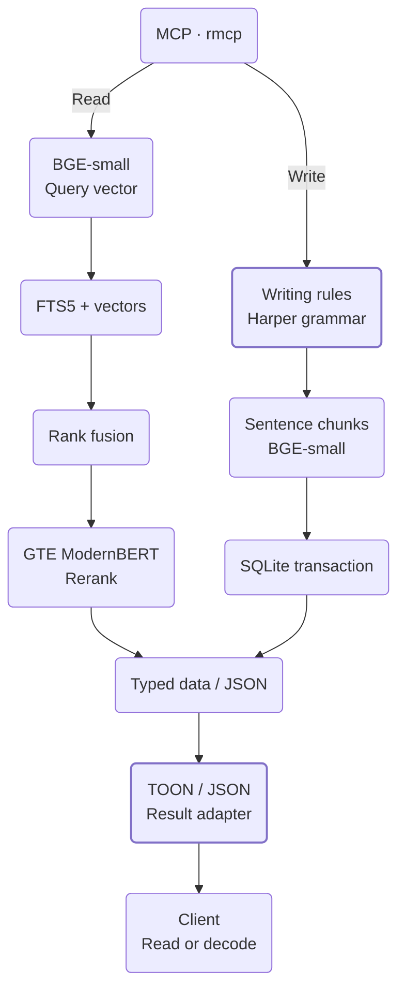

# Enfour Memory

Local RAG for coding agents, with keyword search and semantic search in one Rust service.
Keep facts, exact evidence, and revision history across sessions.

[Connect](#connect) · [Architecture](#architecture) · [Self-host](#self-host) · [Measurements](#measurements) · [Reference](#reference)

## Connect

Use an existing server's URL and bearer token. Add this to `~/.codex/config.toml` on the agent's computer:

```toml
[mcp_servers.enfour-memory]
url = "http://memory.example.com:7463/mcp"
http_headers = { Authorization = "Bearer YOUR_TOKEN" }
startup_timeout_sec = 30
tool_timeout_sec = 180
```

Replace the hostname and token. Keep the configuration private, then restart the client.
Both `/mcp` and `/mcp/rag` use hybrid retrieval and reranking.
One token gives access to all scopes. Use a trusted LAN, TLS proxy, or SSH tunnel.

Install the skills on the agent's computer with Node.js and `npx`:

```sh
DISABLE_TELEMETRY=1 npx skills add http://memory.example.com:7463 --agent codex --skill enfour-recall enfour-maintain -g
```

The skills select a stable project scope, check saved claims, and help with memory writes. Try:

> Save this project decision: use SQLite for local storage. Use this session as the source.

In a new session:

> Recall the storage decision for this project and show its source.

The server runs the local models. No model files or memory checkout are necessary on clients.
Enfour uses no cloud inference or telemetry. Your agent can send retrieved text to its model provider.

## Architecture

SQLite stores source records and revisions. Local models find and rank passages for the agent.
Writing rules must pass before inference. Harper grammar findings are advisory.

<table>
<thead><tr><th>RAG</th></tr></thead>
<tbody>
<tr><td nowrap><code>/mcp</code> · <code>/mcp/rag</code><br/>Search keywords and vectors, then rerank related passages.</td></tr>
<tr><td valign="top" nowrap><a href="assets/diagrams/rag.light.generated.svg"><picture><source media="(prefers-color-scheme: dark)" srcset="assets/diagrams/rag.dark.generated.svg"></picture></a></td></tr>
</tbody>
</table>

Open the graph for a larger view. Accepted writes update embeddings before the SQLite transaction.
Moka caches exact computation. Cache inputs and versions must be the same.
Graph endpoints export JSON or DOT for a frontend.

<details>
<summary>Native Mermaid diagram</summary>

<!-- diagram: rag -->


</details>

Agent memory development is on `experimental/agent-memory`. Use a different state directory for that branch.

## Self-host

Use a Linux x86-64 server with Docker Compose, Python 3.11 or newer, and about 3 GiB of RAM.
Get [ASD-STE100 Issue 9](https://www.asd-ste100.org/STE_downloads.html) and install Poppler.
The private dictionary is mandatory for writes. Keep the PDF and extracted dictionary out of Git.

Run these commands from the repository root:

```sh
scripts/enfour cargo image
scripts/enfour cargo fetch
scripts/enfour cargo build --release --locked --offline
scripts/enfour models
scripts/enfour language --pdf /private/ASD-STE100_ISSUE9.pdf
scripts/enfour up --build
```

Open <http://127.0.0.1:7463>. The token is in `state/access.token`.
For LAN access, copy `.env.example` to `.env`, set `ENFOUR_BIND`, and add the hostname to `ENFOUR_HOSTS`.
The default port is TCP 7463. The dashboard keeps its token only in memory.

Builds use the local Linux Docker socket, Cargo downloads, and sccache.
Use `scripts/enfour --help` for commands. Use `up --build` after a new release build.

<details>
<summary>NixOS and recovery</summary>

Import [nixos/module.nix](nixos/module.nix). Set `services.enfour-memory.enable = true` and `imageFile` to a pinned image archive.
Before activation, stop Compose. Copy state, models, and language data into the module's `dataDir`.
Use `state/`, `models/`, and `language/` there, with the configured `uid` and `gid`.
The boot service is `enfour-memory.service`.

Use systemd to control it. The Python commands control the checkout's Compose service.

Create a consistent database backup:

```sh
scripts/enfour cli --lexical-only backup /data/backup.sqlite
```

The destination must not exist. Also save the token, models, dictionary, and runtime image.

Stop writers before a database backup. Stop the service before restore or migration.
Keep the previous state, including WAL and SHM files, until verification is complete.

Existing records and revisions stay in SQLite after an update from the agent memory branch.
Old Git files and events stay in storage without new updates.

Rebuild indexes after model or chunk-format changes. Review existing memories before `migrate-language`. Keep the original revisions and migration backup.

</details>

## Measurements

Reference host: **ThinkPad T480s · i7-8650U · 16 GiB RAM**. Service limit: two CPUs and 3 GiB.
Quantized BGE-small-en-v1.5 and GTE ModernBERT use about 211 MiB of model files.

The selected profile measured **74.63% Recall@5** and **0.6779 nDCG@10** on 340 LoCoMo development queries.
These queries selected the profile. This is not an independent test result or leaderboard claim.

TOON measurements use v0.4 fixtures without validation metadata: 20 warmups and 2,000 measured runs for each case.
Times include result allocation, without inference, transport, or MCP envelopes. Bytes are not tokens.

| Payload | TOON bytes / µs | Compact JSON bytes / µs | Pretty JSON bytes / µs |
| --- | ---: | ---: | ---: |
| 5 recall hits | 2,127 / 15.519 | 2,936 / 3.304 | 3,652 / 4.042 |
| 16 recall hits | 6,485 / 37.037 | 9,405 / 9.708 | 11,694 / 12.978 |
| Graph | 1,554 / 5.878 | 1,737 / 1.700 | 2,079 / 2.407 |

Writing checks measured 1.626 ms at p50 without cache and 6.165 µs for exact cache hits.
This short-memory sample used 50 runs for each case. The first grammar report used 990 ms.

## Reference

<details>
<summary>Tools, formats, and frontend APIs</summary>

| Tools | Purpose |
| --- | --- |
| `recall`, `inspect` | Find evidence and read revision history. |
| `validate_memory`, `remember` | Check prose, then save a revision with a source. |
| `forget`, `relate`, `graph` | Hide records, link facts, and export relations. |

Writes must have a source and the current revision. Use revision `0` for a new key.

TOON is the default result text. Set the `minify` header to `uglify-json` for compact JSON or `none` for JSON with spaces and newlines.
Inputs, storage, and computation keep typed data or JSON. Only return text changes.

Authenticated frontend endpoints: `/api/recall`, `/api/graph`, `/api/graph.dot`, and `/api/status`.
Graph exports accept `?scope=…`.
The public `/mcp/skills` endpoint gives installation instructions without memory access.

</details>

<details>
<summary>Writing policy and rule coverage</summary>

Enfour applies a 20-word sentence limit and six-sentence paragraph limit.
Keep exact evidence in code or quotations, with prose about the evidence and a source.
Queries, identifiers, and model prefixes keep their original form. Harper grammar findings are advisory.
Rejected writes use no inference and change no records or indexes.
Accepted revisions record policy, validator, dictionary, and glossary versions.

| Coverage | Issue 9 rules |
| --- | --- |
| Enforced | 1.1, 4.1, 5.1, 6.3, 4.2, 6.6, 8.1, 8.4–8.7 |
| Advisory | 1.2, 1.4, 2.1, 3.1–3.6 |
| Contextual review | 1.3, 1.5–1.14, 2.2, 3.7, 4.3–4.5, 5.2–5.5, 6.1–6.2, 6.4–6.5, 7.1–7.3, 8.2–8.3, 9.1–9.4 |

The 20-word limit is below the 25-word limit for descriptions in Issue 9.
Passed checks do not show complete compliance. [Review meaning and context](https://www.asd-ste100.org/STEsoftware.html), including negation, quantities, conditions, and uncertainty.

</details>

<details>
<summary>Development and diagram source</summary>

Use targeted checks for regular changes. With a fix, include the failure and the checks that apply.
Public tests use a synthetic dictionary. Release builds must remove `test-support`.

```sh
scripts/enfour check helpers
scripts/enfour check product --language language-private/dictionary.json
scripts/enfour diagrams --setup
scripts/enfour diagrams
scripts/enfour diagrams --check
```

Diagram tools use Node.js, npm, and Chromium on the computer that creates these files only.
SVGs come from the Mermaid blocks above. Run retrieval evaluations at evaluation milestones.

</details>

[MIT license](LICENSE). TOON fixtures keep their license and provenance.
