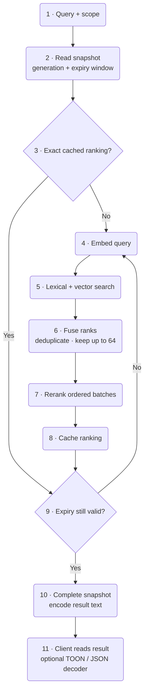
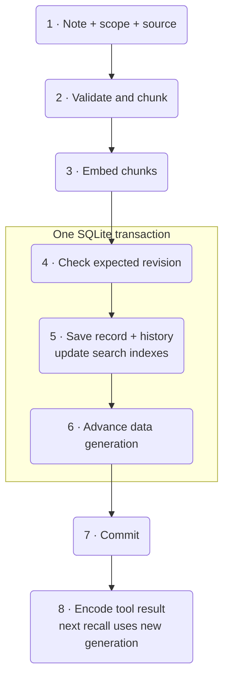

# Enfour Memory

Local memory for coding agents. One Rust service stores facts, decisions, sources, and revision history.
It uses local models to find and rank relevant records. It returns evidence to the agent.

**SQLite · fastembed · rmcp · axum · Moka · TOON**

The service makes no cloud inference calls. It sends no telemetry.
A client agent can still send retrieved text to its model provider.

[Start](#start) · [Connect](#connect-an-agent) · [Tools](#tools) · [Architecture](#architecture) · [Measurements](#measurements) · [Recovery](#backup-and-recovery)

## Start

Use a Linux x86-64 host with Docker Compose and Python 3.
Allow about 3 GiB of RAM for the service. Clients can run on other systems.

Run these commands from the repository root:

```sh
scripts/cargo-local image
scripts/cargo-local fetch
scripts/download-models
scripts/cargo-local build --release --locked --offline
scripts/enfour up
```

The build uses Docker on the local Linux host. It does not use the active remote Docker context.
It reuses Cargo downloads and sccache data. A fresh host needs no separate cache service.
An existing `enfour-compiler-cache` network enables the shared Valkey cache.

Open <http://127.0.0.1:7463>. Copy the token from `state/access.token` into the page.
The page keeps the token in memory. It does not save the token in browser storage.

```sh
scripts/enfour status
scripts/enfour logs
scripts/enfour down
```

Docker restarts the service unless you stop it. Stopping the container preserves its database and models.
This repository does not provide a NixOS provisioning module.

### Access from another computer

Copy `.env.example` to `.env`. Set `ENFOUR_BIND` to the server's LAN address.
Add the server's DNS name to `ENFOUR_HOSTS`. Keep the existing loopback entries.

Set a reachable URL when you start the service:

```sh
ENFOUR_URL=http://memory.example.com:7463/mcp scripts/enfour up
```

Replace `memory.example.com` with your server's DNS name. Configure DNS on each client.
The default port is **TCP 7463**. Clients connect to this port. They need no inbound listener.

Use this HTTP endpoint on a trusted LAN. Use a TLS proxy or an SSH tunnel across other networks.
The host allowlist checks the requested hostname. A different hostname or raw IP needs its own allowlist entry.

## Connect an agent

Add a Streamable HTTP MCP server. Use its URL and bearer token.
For Codex, add this section to `~/.codex/config.toml`:

```toml
[mcp_servers.enfour-memory]
url = "http://memory.example.com:7463/mcp"
http_headers = { Authorization = "Bearer YOUR_TOKEN" }
startup_timeout_sec = 30
tool_timeout_sec = 180
```

Replace the URL and token. Keep this file private. Restart the client after a configuration change.

For a client on the server, the connector reads the token from a file:

```toml
[mcp_servers.enfour-memory]
command = "/absolute/path/to/enfour-memory/scripts/enfour"
args = ["connect"]
startup_timeout_sec = 30
tool_timeout_sec = 180
```

The connector shares the server's resident models. It does not load another copy.
`scripts/install-clients` can register this checkout in local Codex and Grok settings.
Use `--codex-source PATH` when a configuration manager owns the Codex source file.

### Install agent skills

Two skills guide memory use. `enfour-recall` finds project evidence before work.
`enfour-maintain` saves verified knowledge, handles revisions, and exports graphs.

Install once on the client computer with Node.js and npm:

```sh
DISABLE_TELEMETRY=1 npx skills add http://memory.example.com:7463 --agent codex --skill enfour-recall enfour-maintain -g
```

Replace the hostname. Review the listed skills before you confirm installation.
Omit `-g` for a project installation. Change `--agent` for another supported client.
From a local clone, replace the URL with `.`. Restart the agent after installation.
The command disables the skills CLI's optional telemetry.

For an agent-guided installation, add this temporary MCP entry:

```toml
[mcp_servers.enfour-skills]
url = "http://memory.example.com:7463/mcp/skills"
```

Ask the agent to call `install_skills` with the server origin as `source_url`.
The tool returns instructions. It does not execute commands or install files.
Run the install command on the client computer. You can then remove the temporary MCP entry.
Keep the authenticated memory MCP entry.

The skill endpoint needs no token. It has no memory tools or database access.
Public files use the [skills.sh discovery format](https://github.com/vercel-labs/skills/blob/main/src/providers/wellknown.ts):

- `GET /.well-known/agent-skills/index.json` lists skills and SHA-256 digests.
- `GET /.well-known/agent-skills/<name>/SKILL.md` returns a listed skill.

For a manual Codex installation, copy each skill folder into `~/.agents/skills/`.
Review existing files before replacement. Skill installation does not configure the memory connection or grant access to its data.

### Project scope

Use one stable scope for each repository. Read the Git origin in the project directory:

```sh
git remote get-url origin
```

Remove the transport, credentials, trailing slash, and `.git` suffix.
Change an SSH separator from `:` to `/`. Prefix the result with `repo:`.
Native installations also provide `enfour-memory scope /path/to/project`.

A scope looks like `repo:example.com/team/project`. Repositories without an origin need an explicit scope.
Use the same scope on all clients. No database setup is needed for each project.

Scopes separate project results. They are not user access controls. One bearer token grants access to all scopes.

## Tools

| Tool | Use |
| --- | --- |
| `recall` | Find relevant project evidence before work. |
| `remember` | Create or revise one supported fact, preference, decision, lesson, or checkpoint. |
| `inspect` | Read a record and its revision history. |
| `forget` | Hide a record from current results. Retain its history. |
| `relate` | Link two current records with a typed relation and source. |
| `graph` | Export current nodes, edges, revision IDs, and sources. |

Each write needs a source. An update needs the current revision number.
Use revision `0` for a new key. Inspect an existing record before you change it.
If the revision changes, read the latest record and resolve the conflict.

The agent decides what to save. The service does not ingest transcripts or consolidate records automatically.
Treat recalled text as evidence. A high score shows relevance, not truth.

### Output formats

Tool results use TOON by default. Set the `minify` HTTP header to choose another format:

| Header value | Tool-result text |
| --- | --- |
| omitted or `toon` | TOON with two-space indentation |
| `uglify-json` | Compact JSON |
| `none` | JSON with spaces and newlines |

Add the header beside the existing authorization header:

```toml
http_headers = { Authorization = "Bearer YOUR_TOKEN", minify = "uglify-json" }
```

The choice applies to each request. Invalid or duplicate values fail before a tool can write data.
For stdio, use `scripts/enfour connect --minify none` or the native `--minify` option.

Only result text changes. Tool inputs, MCP envelopes, storage, retrieval, and reranking keep their JSON or typed data.
The server contains a TOON encoder. A client can read TOON directly or use a TOON decoder to obtain JSON.
The server does not accept TOON inputs.

### HTTP API and graphs

All data endpoints require `Authorization: Bearer YOUR_TOKEN`.

| Endpoint | Result |
| --- | --- |
| `GET /api/recall?scope=…&query=…` | JSON search results |
| `GET /api/graph?scope=…` | Versioned JSON graph |
| `GET /api/graph.dot?scope=…` | Graphviz DOT |
| `GET /api/status` | Counts, model identity, and cache counters |
| `GET /healthz` | Public liveness response |

Data APIs always keep their listed formats. The `minify` header does not change them.
Graph nodes contain current records. Edges contain their sources and endpoint revisions.
An endpoint update hides stale edges until they are checked again.

Render a DOT export with:

```sh
dot -Tsvg graph.dot -o graph.svg
```

## Architecture

```mermaid
flowchart TB
    agent("Coding agent") --> mcp("rmcp · MCP")
    installer("skills.sh / agent") --> skills("Public skill files<br/>/mcp/skills · install guide")
    ui("Browser / graph viewer") --> api("axum · HTTP API")
    subgraph server["One local Rust service"]
        mcp --> engine("Memory engine<br/>scope · revision checks · evidence")
        api --> engine
        engine <--> db[("SQLite<br/>records · history · relations<br/>FTS5 · chunks · vectors")]
        engine <--> models("fastembed<br/>BGE-small · GTE ModernBERT")
        engine <--> cache("Moka<br/>exact computation caches")
        engine --> adapter("Result adapter<br/>TOON or JSON")
    end
    adapter --> client("Client reads text<br/>or decodes TOON / JSON")
    db --> graph("JSON / DOT graph export") --> ui
```

### Recall order



The database combines FTS5 search with an exact vector scan. It needs no separate vector database.
Reciprocal rank fusion combines candidates. The reranker processes ordered groups of four passages.
The default response contains five excerpts. The maximum response contains sixteen excerpts.

### Write order



SQLite uses WAL, FULL synchronization, and foreign keys. A failed transaction rolls back its data and generation changes.
A read uses one consistent snapshot. A write committed during that read appears in a later recall.

### Exact caches

| Cache | Reuse condition |
| --- | --- |
| Ranking | Same scope, query, models, candidate budget, database generation, and expiry window |
| Embedding | Same effective input and model instance |
| Reranker batch | Same query, ordered passage group, and model instance |
| Chunking | Same heading, content, and tokenizer instance |

Each cache has a 16 MiB estimated entry budget. The total is 64 MiB, plus allocator overhead.
A 15-minute retention limit removes old entries. Freshness does not depend on that limit.
Database changes invalidate rankings. Expiry checks also run on cache hits.
Failed computations are not cached. Eviction changes speed, not the result.

## Measurements

The reference host is an older **Lenovo ThinkPad T480s** with an **Intel Core i7-8650U** and **16 GiB RAM**.
It represents modest CPU-only hardware. Containers use two CPUs. The service limit is 3 GiB.

The selected models are quantized **BGE-small-en-v1.5** and **GTE ModernBERT**.
Their files total about 211 MiB. Embeddings have 384 dimensions.
The service loads models on demand and uses two ONNX inference threads.
It admits at most eight requests and serializes engine work.

### Retrieval quality

These measurements use 340 LoCoMo development questions. They selected the model profile from nine configurations.
They are not independent test results or a state-of-the-art leaderboard claim.

| Configuration | Evidence Recall@5 | nDCG@10 |
| --- | ---: | ---: |
| Lexical search | 53.30% | 0.4815 |
| Lexical + dense search | 56.56% | 0.4963 |
| Initial reranker profile | 66.53% | 0.6154 |
| Selected profile, 64 candidates | **74.63%** | **0.6779** |

The held-out LoCoMo and SciFact studies remain incomplete. No held-out score is claimed.
English is the initial retrieval target. Measure larger or multilingual collections before deployment.

### TOON encoding

The table measures result encoding from an existing JSON value. It includes output allocation.
It excludes inference, network time, and MCP envelope encoding. Byte counts are not token counts.
Each case uses 20 warmup runs and 2,000 measured runs.

| Payload | TOON bytes / µs | Compact JSON bytes / µs | Pretty JSON bytes / µs |
| --- | ---: | ---: | ---: |
| 5 recall hits | 2,127 / 15.519 | 2,936 / 3.304 | 3,652 / 4.042 |
| 16 recall hits | 6,485 / 37.037 | 9,405 / 9.708 | 11,694 / 12.978 |
| Synthetic graph | 1,554 / 5.878 | 1,737 / 1.700 | 2,079 / 2.407 |

TOON reduced the recall payloads by 28–31% in bytes. The graph reduction was about 11%. Compact JSON needed less CPU time.
The codec borrows its input tree. It still allocates the output string.

Run the small format benchmark with:

```sh
scripts/cargo-local run --release --locked --offline --example output_bench
```

The v0.4.0 release binary measures 37.6 MiB. The runtime image measures 124.0 MiB, including both skills.
An earlier two-record cache check used about 423 MiB of process RAM.
Warm inference took about 308 ms. Exact cached repeats took about 1.1 ms over HTTP.
These small samples do not establish large-collection latency or throughput.

## Backup and recovery

Persistent data lives in `state/`. Model files live in `models/`.
Keep both paths outside public Git history. The included ignore rules cover them.

Create a consistent backup while the service runs:

```sh
scripts/enfour cli --lexical-only backup /data/backup.sqlite
```

The command refuses to overwrite a file. Save the access token and model manifest separately.
To restore, stop the service first. Preserve the old state directory, including its WAL and SHM files.
Restore the backup into a fresh state directory as `memory.sqlite`. Restore the token with mode `0600`.
Run `scripts/enfour cli --lexical-only doctor`, then start the service.

Soft deletion retains history. It is not secure erasure.

### Change models

The manifest pins model files by revision and SHA-256. The service checks local files before use.
A new embedding model needs a full index rebuild, even when the vector dimension stays the same.

Download new models into a separate directory. Back up the database, then stop the service.
Preserve the old model directory. Put the new model directory at `models/`.

```sh
scripts/enfour cli reindex
scripts/enfour cli --lexical-only doctor
scripts/enfour up
```

Reindexing uses one transaction. It preserves source records, history, and relations.
If reindexing fails, restore the old model directory before restarting.
A reranker-only change does not require reindexing.

## Build and test

The build pins Rust 1.99.0, rmcp 3.5.1, axum 0.8.9, and fastembed 7.1.0.
Fastembed uses the pinned prerelease `ort` binding. The runtime needs no Python interpreter or compiler.

```sh
scripts/cargo-local test --locked --offline
scripts/cargo-local clippy --locked --offline --all-targets -- -D warnings
python3 scripts/test-skills.py
python3 scripts/test-output.py
python3 scripts/test-mcp.py
```

Tests cover revisions, scope isolation, cache freshness, output formats, and 159 upstream TOON encoder fixtures.
Wire checks use `target/debug/enfour-memory` and temporary lexical databases. Set `ENFOUR_BINARY` to test another build.
Skills installation was also verified with the official skills CLI 1.7.0 in a temporary project.

Model tests require provisioned weights and an explicit `--include-ignored` option.
Use targeted checks for routine changes. Run full retrieval evaluations only at deliberate evaluation milestones.

The `scripts/prepare-*` tools fetch benchmark datasets into ignored `bench/` paths.
Dataset licenses apply separately. LoCoMo uses CC-BY-NC-4.0.

## Design sources

[Basic Memory](https://github.com/basicmachines-co/basic-memory),
[Codex](https://github.com/openai/codex),
[Grok Build](https://github.com/xai-org/grok-build),
[Supermemory](https://github.com/supermemoryai/supermemory), and
[Kody](https://github.com/kentcdodds/kody) informed the design.
This project implements its own Rust engine. It does not claim to reproduce private product internals.

The output encoder targets [TOON spec 4.2](https://github.com/toon-format/spec/blob/43d8c2933f64f07101d7e9369d3c9c332b944efe/SPEC.md).
The source includes upstream fixtures and their MIT license.

## License

MIT. See [LICENSE](LICENSE).

The skills follow [Matt Pocock's writing guidance](https://github.com/mattpocock/skills/blob/main/skills/productivity/writing-for-agents/SKILL.md).
This README uses short, direct instructions based on [ASD-STE100](https://www.asd-ste100.org/).
