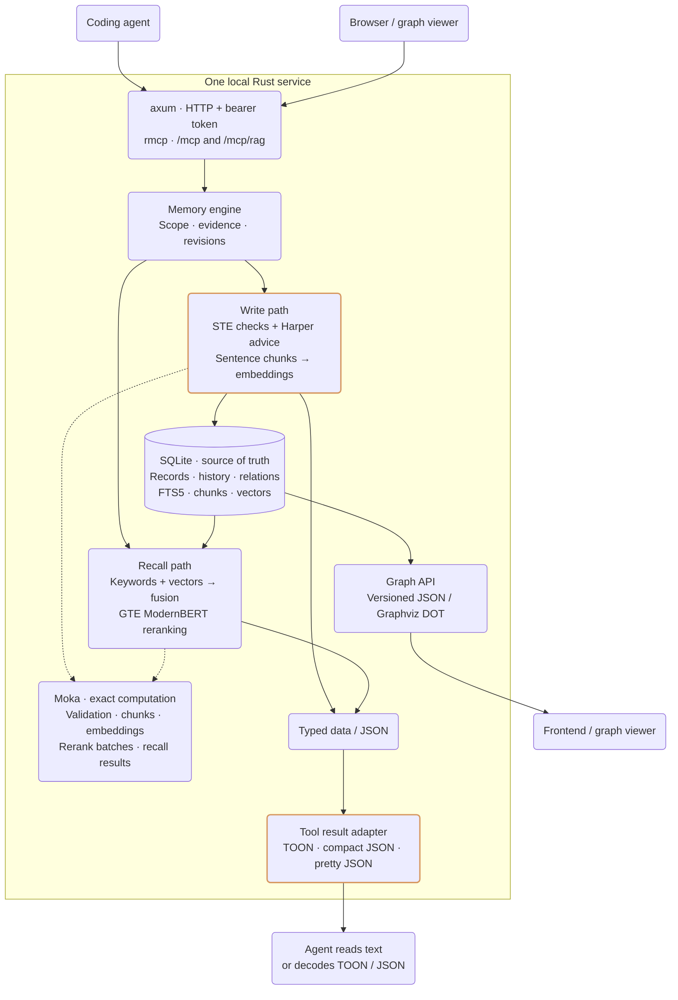
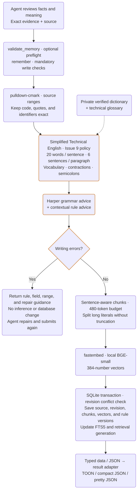
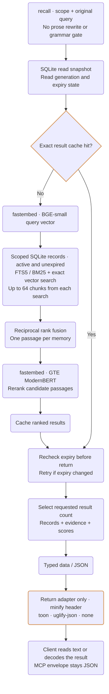

# RAG service

[Enfour Memory](../README.md)

SQLite stores source records and revisions.

STE errors block writes. Harper findings are advisory. Missing private language data also blocks writes.
The agent reviews meaning, negation, quantities, conditions, and uncertainty. No model changes the prose.

Moka caches exact inputs. Cache inputs and versions must be the same. Recall keys also include scope, database generation, and expiry state.
Expired or changed records cannot use stale rankings. An empty cache only adds computation.

Graph exports return scoped JSON or DOT for a frontend. Tool adapters change return text only.

### RAG service

<!-- diagram: rag -->

### Save a memory

<!-- diagram: write -->

### Recall a memory

<!-- diagram: recall -->

